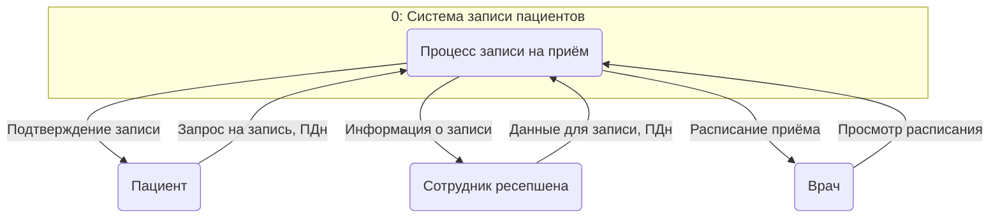
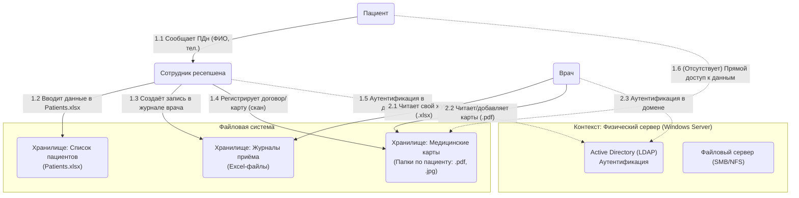
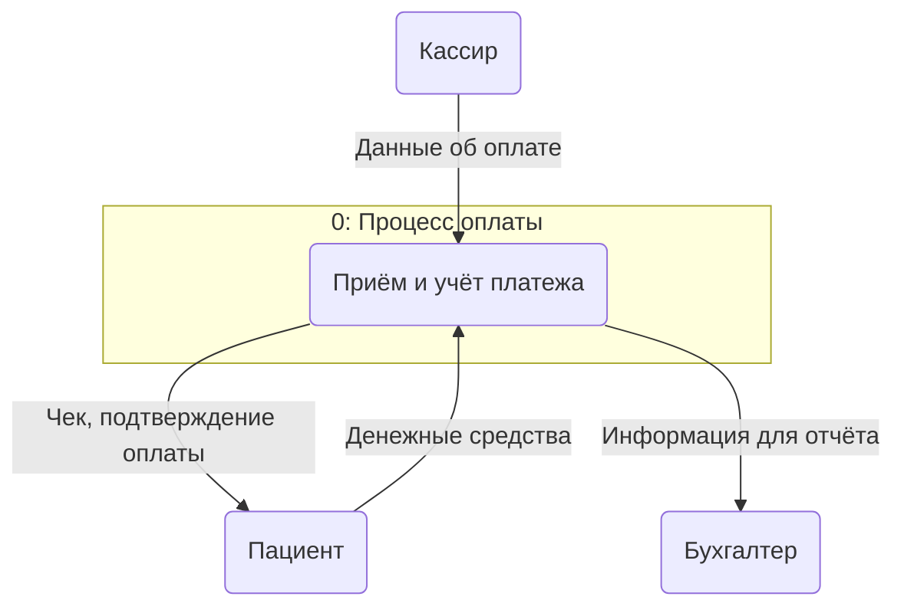
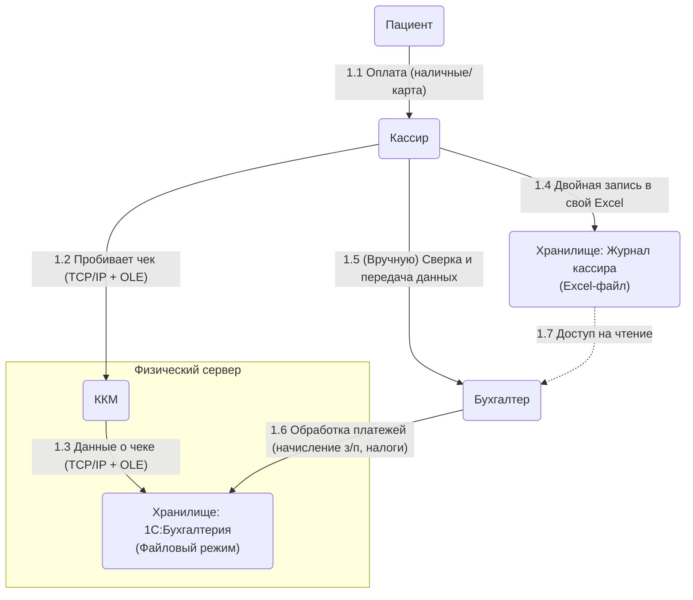
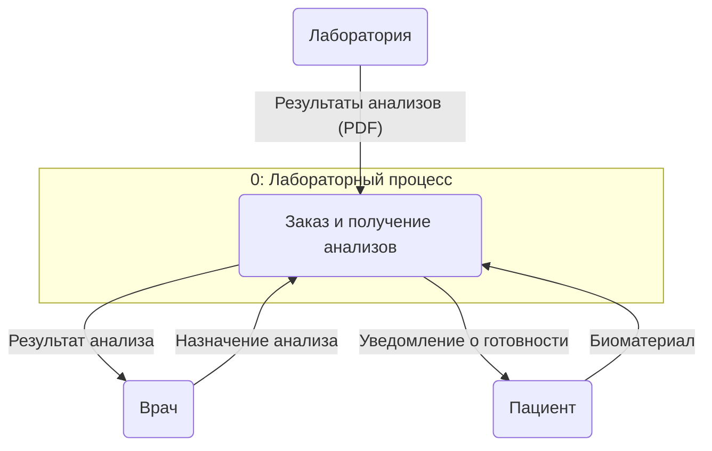
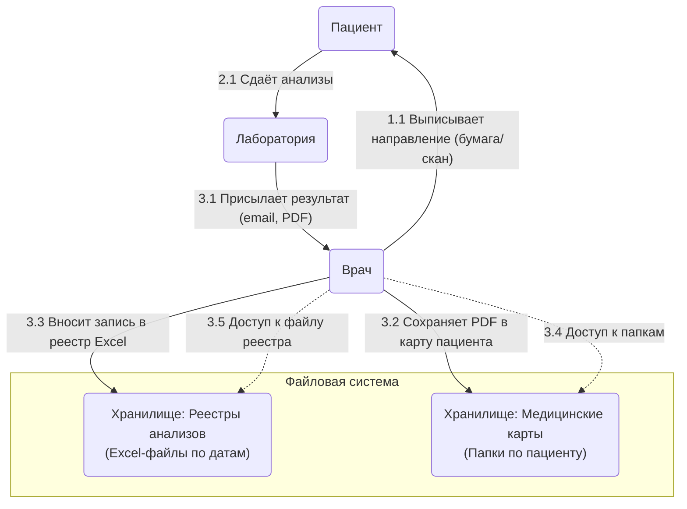
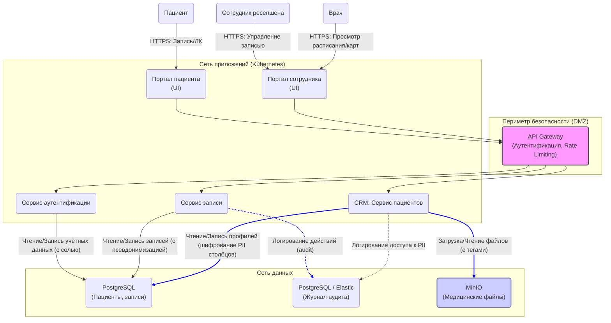
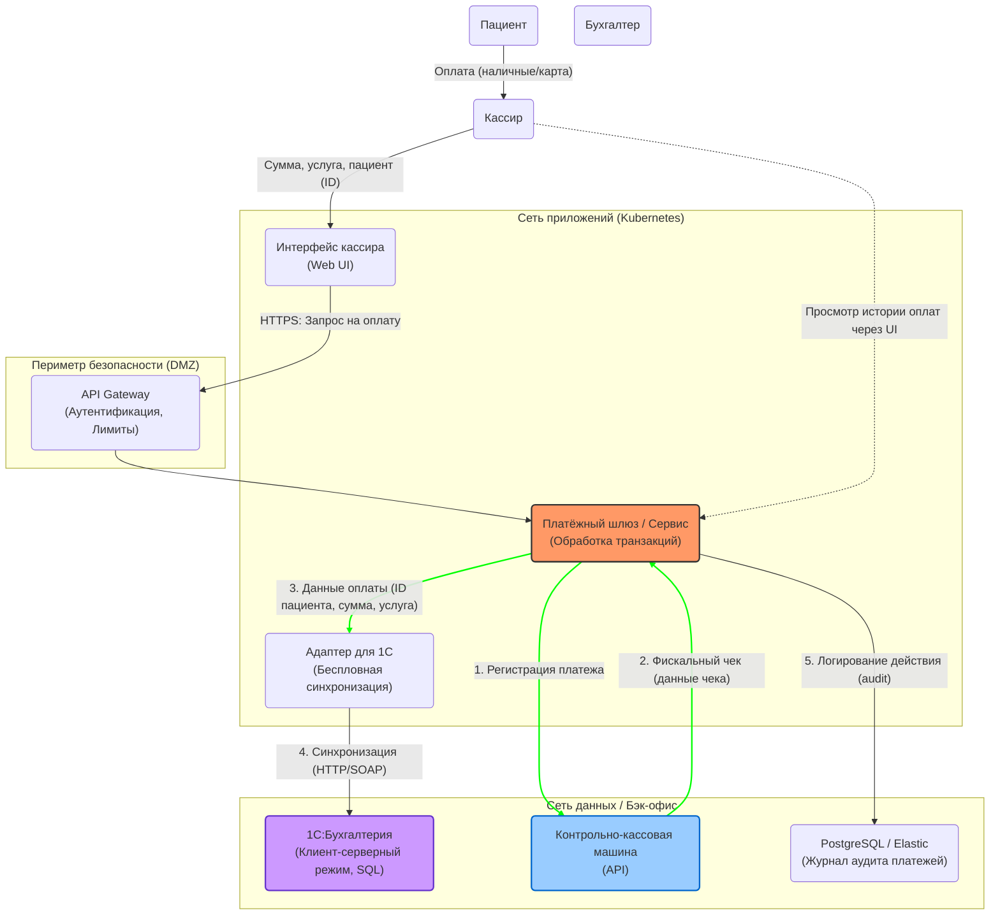
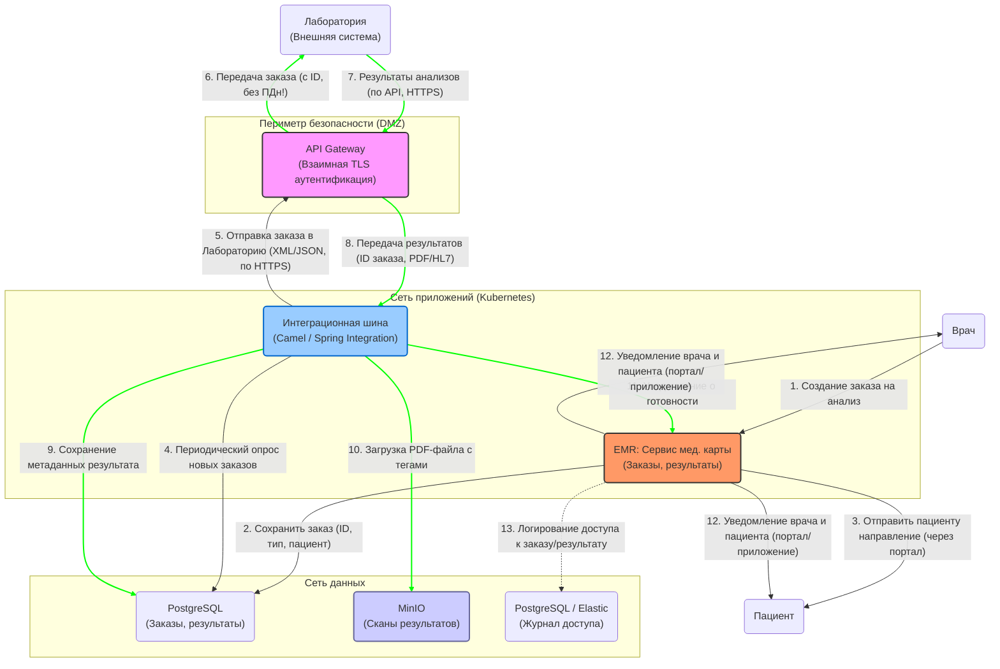

### **Задание 1. Анализ безопасности системы**

### **1. Выявление конфиденциальных данных и построение диаграмм потоков данных (DFD)**

#### **1.1. Категории конфиденциальных данных (PII и Sensitive Data)**

| Категория данных | Примеры | Где хранятся сейчас (AS-IS) | Статус учёта |
| :--- | :--- | :--- | :--- |
| **Идентификационные данные (PII)** | ФИО, дата рождения, телефон, email, адрес, паспортные данные (в сканах договоров), место работы. | Excel-файлы (Patients.xlsx), сканы договоров (PDF/JPG) на файловом сервере. | **Учтены частично, нет структуры** |
| **Медицинские данные (Специальная категория)** | Сведения о состоянии здоровья, диагнозы, хронические заболевания, результаты анализов, заключения врачей. | Сканы мед. карт (PDF/JPG), файлы результатов анализов из лаборатории, записи в Excel-журналах врачей. | **Не структурированы, высокий риск** |
| **Финансовые данные** | Информация об оплате услуг, данные о зарплате сотрудников. | Excel у кассиров (двойной учёт), 1С:Бухгалтерия (файловый режим). | **Учтены, но нет разграничения доступа внутри 1С к ПДн** |
| **Данные о трудовой деятельности** | Трудовые договоры, кадровые приказы, паспортные данные сотрудников. | Сканы на файловом сервере, 1С:Бухгалтерия. | **Не централизованы, высокий риск** |
| **Данные о ТМЦ** | Информация о закупках, поставщиках. | 1С:Торговля и склад (файловый режим). | **Учтены, низкий риск** |

**Вывод:** В текущей системе отсутствует реестр обрабатываемых персональных данных. Данные не классифицированы, хранятся бессистемно, что является прямым нарушением принципов Data Minimization и требует немедленной инвентаризации.

#### **1.2. Диаграммы потоков данных (Data Flow Diagrams) для ключевых процессов**

Следуя руководству по созданию DFD ([ссылка на гайд Lucidchart](https://www.lucidchart.com/blog/data-flow-diagram-tutorial)), мы построим диаграммы для трёх основных бизнес-процессов, начиная с контекстного уровня (Level 0) и переходя к детализации (Level 1).

**Нотация:** Используем нотацию Гейна-Сарсона (Gane-Sarson), где:
*   **Квадрат** — Внешняя сущность (пациент, сотрудник, лаборатория).
*   **Овал/Прямоугольник со скруглёнными углами** — Процесс.
*   **Открытый прямоугольник** — Хранилище данных.
*   **Стрелка** — Поток данных.

---

##### **Процесс А: Запись пациента на приём и регистрация**

**Контекстная диаграмма (Level 0):**
Взаимодействие между пациентом, сотрудником ресепшена и врачами.



**Диаграмма Level 1 (Детализация):**
Показывает, как данные перемещаются между системами и где хранятся.



**Анализ потоков данных (Процесс А):**
*   **Поток 1.2:** ПДн пациента вносятся в неструктурированный Excel-файл. Нет контроля целостности и валидации данных.
*   **Поток 1.3:** Данные о записи дублируются в журнале конкретного врача. Нет единого расписания.
*   **Поток 1.4:** Медицинские документы сохраняются как "blob" (набор бинарных файлов) в папке пациента. Метаданные не извлекаются, поиск невозможен.
*   **Хранилища:** Все хранилища не имеют встроенных механизмов разграничения доступа, кроме прав на папки в файловой системе (на уровне AD). Это означает, что любой аутентифицированный сотрудник с доступом к диску может потенциально читать любые файлы.

---

##### **Процесс Б: Приём платежа за услугу**

**Контекстная диаграмма (Level 0):**



**Диаграмма Level 1 (Детализация):**



**Анализ потоков данных (Процесс Б):**
*   **Поток 1.4 (Двойная запись):** Классический риск рассинхронизации данных и ошибок из-за человеческого фактора. Данные об оплате, связанные с пациентом, хранятся в неконтролируемом Excel-файле кассира.
*   **Хранилище 1С (файловый режим):** Работа в файловом режиме не обеспечивает должной целостности данных при одновременном доступе и не имеет тонких настроек аудита, кто и когда смотрел конкретные финансовые данные, связанные с ПДн.
*   **Поток 1.5:** Передача данных между кассиром и бухгалтером происходит вне какой-либо системы (по email, в мессенджере, на флешке), что создаёт неконтролируемые копии ПДн.

---

##### **Процесс В: Взаимодействие с лабораторией анализов**

**Контекстная диаграмма (Level 0):**



**Диаграмма Level 1 (Детализация):**



**Анализ потоков данных (Процесс В):**
*   **Отсутствие API (Поток 3.1):** Интеграция с лабораторией отсутствует. Результаты приходят по незащищённым каналам (email), что является критической уязвимостью для медицинских данных.
*   **Ручная обработка (Поток 3.2, 3.3):** Врач вручную сохраняет файлы и вносит записи в Excel. Это крайне неэффективно и чревато ошибками (можно перепутать результаты пациентов).
*   **Неструктурированные данные:** Результаты анализов хранятся как немые PDF, их содержание не индексируется и не доступно для автоматического анализа.

---

### **2. Аудит мер по обеспечению безопасности данных**

Сопоставим текущие процессы с требованиями законодательства РФ (152-ФЗ) и лучшими архитектурными практиками.

| Область | Требование / Практика | Текущее состояние в «Медикаменте» (AS-IS) | Проблемная зона / Риск |
| :--- | :--- | :--- | :--- |
| **Учёт ПДн** | Ст. 22.1 152-ФЗ: Уведомление РКН об обработке ПДн. Ведение внутреннего учёта. | Отсутствует реестр обрабатываемых ПДн. Компания может не знать полный объём данных. | **Критический риск:** Штрафы от РКН, предписания о блокировке ресурсов. |
| **Согласие на обработку** | Ст. 9 152-ФЗ: Письменное согласие для спец. категорий (мед. данные). | Согласие, вероятно, включено в договор, но нет контроля за его отзывом. | **Средний риск:** Невозможность быстро прекратить обработку по требованию клиента. |
| **Локализация данных** | Ст. 18 152-ФЗ: Базы данных ПДн россиян должны находиться в РФ. | Сервер находится в РФ. Формально выполнено. | **Низкий риск.** |
| **Контроль доступа (RBAC)** | Принцип минимальных привилегий (PoLP). Доступ только на основе роли. | Только доменная аутентификация (AD). Любой сотрудник может открыть любой Excel или PDF. | **Критический риск:** Массовые утечки изнутри, невозможность доказать, кто именно смотрел файл. |
| **Аудит доступа** | Необходимость логирования действий с ПДн (кто, когда, зачем). | Полностью отсутствует. Нет журналов доступа к файлам на уровне чтения/записи. | **Критический риск:** Невозможно расследовать инциденты, определить масштаб утечки. |
| **Шифрование данных** | Шифрование при хранении (at rest) и передаче (in transit). | Шифрование диска сервера? — неизвестно. Передача данных — открытые протоколы (SMB, email). | **Высокий риск:** Перехват трафика, кража физического носителя. |
| **Защита каналов связи** | Использование защищённых протоколов (HTTPS, SFTP, VPN). | Обмен с лабораторией по email (POP3/IMAP/SMTP часто без шифрования). | **Критический риск:** Перехват медицинских данных. |
| **Принципы Privacy by Design** | Data Minimization (сбор только нужного). | Сбор расширенной информации о пациенте без чёткого обоснования. | **Средний риск:** Избыточный объём ответственности за ненужные данные. |
| **Реагирование на инциденты** | План реагирования на утечки данных. | Отсутствует. | **Высокий риск:** Репутационный и финансовый ущерб при утечке. |

---

### **3. Предложения по улучшению (TO-BE)**

#### **3.1. Классификация данных и методы защиты**

Для каждой категории данных определим рекомендуемый метод защиты.

| Категория данных | Примеры | Уровень критичности | Рекомендуемый метод защиты в состоянии покоя (at rest) | Рекомендуемый метод защиты в процессе использования |
| :--- | :--- | :--- | :--- | :--- |
| **Прямые идентификаторы** | ФИО, Паспортные данные, Телефон, Email, Адрес. | **Очень высокий** | **Шифрование** (AES-256) в БД. Маскирование в UI для сотрудников без необходимости. | **Псевдонимизация**. Замена на внутренний ID в большинстве процессов. |
| **Медицинские данные** | Диагнозы, анализы, заключения. | **Очень высокий** | **Шифрование** (AES-256) в БД и файловом хранилище. | **Шифрование** в каналах связи (TLS 1.3). **Обезличивание** для аналитики (Data Lineage). |
| **Финансовые данные** | Суммы оплат, номера карт (первые 6 и последние 4). | **Высокий** | **Шифрование**. | **Обезличивание** (токенизация) для аналитики. |
| **Авторизационные данные** | Пароли, хэши паролей. | **Критический** | **Хэширование с солью** (bcrypt, Argon2). | Никогда не передавать в открытом виде. |
| **Квази-идентификаторы** | Дата рождения, пол, должность. | **Средний** | **Контроль доступа**. | Могут комбинироваться для деанонимизации, требуют осторожности при выгрузках. |

#### **3.2. Разработка механизма тегирования данных**

Для автоматизации контроля и аудита предлагается внедрить систему тегирования (data tagging) данных.

*   **Инструменты:**
    *   **Для структурированных данных (БД):** Использовать возможности PostgreSQL (расширения типа `pg_tags` или встроенные метки столбцов). В приложениях (Java) можно использовать библиотеки для аннотирования полей сущностей (например, Hibernate @Column, но с кастомной аннотацией `@SensitiveData`).
    *   **Для неструктурированных данных (файлы):** При загрузке в систему (S3-совместимое хранилище, например, MinIO) назначать файлу теги (метаданные) через API. Пример тегов: `pii=true`, `category=medical`, `retention_period=25y`, `consent_withdrawn=false`.
    *   **Для потоков данных:** В шине данных (Kafka) тегировать сообщения в хедере, чтобы системы-подписчики знали, как обрабатывать данные (маскировать в логах, шифровать при записи).

*   **Процесс:**
    1.  **Создание таксономии тегов:** Определить набор тегов (Категория, Чувствительность, Срок хранения, Статус согласия).
    2.  **Интеграция в CI/CD:** На этапе сборки проводить статический анализ кода для выявления новых полей с ПДн (по аннотациям) и проверять, назначены ли им теги.
    3.  **Автоматическая проверка (Policy as Code):** При попытке передать данные в BI-систему (например, ClickHouse), политика безопасности проверяет теги. Если данные с тегом `pii=true` пытаются отправить без обезличивания, передача блокируется.
    4.  **Мониторинг и алертинг:** Система (например, на базе Elastic) индексирует теги. Настроить алерты на необычную активность: "Пользователь из отдела кадров запросил 10 000 записей с тегом `medical` за последний час".

#### **3.3. Список рекомендуемых инструментов и мер**

1.  **Управление идентификацией и доступом (IAM):** Внедрение Keycloak или переход на Azure AD / Google Cloud Identity. Это обеспечит единый вход (SSO) и централизованное управление правами (RBAC/ABAC).
2.  **База данных:** Перевод данных из Excel в **PostgreSQL**. Настроить шифрование на уровне таблиц (столбцов) с помощью pgcrypto.
3.  **Хранилище файлов:** Вместо файлового сервера — **MinIO** (S3-совместимое объектное хранилище) с поддержкой шифрования на стороне сервера (SSE) и тегированием объектов.
4.  **Шина данных (Message Broker):** **Apache Kafka** с конфигурацией TLS для шифрования каналов и возможностью тегирования сообщений.
5.  **API Gateway:** Использовать **Kong** или **nginx** для централизованной аутентификации, авторизации и rate limiting для всех API (включая интеграцию с лабораторией).
6.  **Мониторинг и аудит:** Стек **Elasticsearch, Logstash, Kibana (ELK)** или **Grafana Loki** для сбора и анализа логов доступа. Настроить аудит на уровне БД (pgAudit) и S3-хранилища.
7.  **Обезличивание данных:** Использовать ETL-инструменты (например, **Apache Airflow** с Python-скриптами) для регулярного создания обезличенных датасетов в **ClickHouse** для аналитики (BI/ML).

#### **3.4. Доработанные диаграммы потоков данных (TO-BE)**

Ниже представлено, как должен выглядеть поток **Процесса А (Запись на приём)** в целевой архитектуре.



**Пояснения к доработанной диаграмме:**

*   **Шифрование и TLS:** Все внешние и внутренние коммуникации идут по протоколу **HTTPS (TLS)**.
*   **Контроль доступа (RBAC/ABAC):** API Gateway и сервисы проверяют права пользователя. Администратор не имеет доступа к медицинским данным без явного разрешения.
*   **Псевдонимизация:** В сервисе записи (`AppointmentService`) и в расписании врача ФИО пациента заменены на уникальный ID. Врач видит карту, только перейдя по прямой ссылке из защищённого контекста.
*   **Шифрование данных (At Rest):** В базе данных `DB_Patients` столбцы с ФИО, телефоном и т.д. хранятся в зашифрованном виде. Файлы в `FileStorage` (MinIO) шифруются автоматически.
*   **Аудит:** Каждое обращение к сервисам пациентов и записи логируется в отдельное хранилище аудита (`DB_Audit`). Это позволяет отследить любые подозрительные действия.
*   **Тегирование:** При загрузке файла в `FileStorage` сервис `PatientService` добавляет к нему теги: `{"patient_id": "xxx", "data_type": "lab_result", "sensitivity": "high", "consent": "true"}`.


#### **3.5. Доработанная диаграмма для Процесса Б: Приём платежа за услугу**

В целевой архитектуре мы уходим от двойной записи и файлового режима 1С. Платежный шлюз становится центральным звеном, а все учётные системы обмениваются данными автоматически.



**Пояснения к диаграмме (Процесс Б):**

*   **Устранение двойной записи (Поток 1.4 из AS-IS):** Кассир работает в веб-интерфейсе (`PaymentUI`). Данные об оплате вводятся один раз и через `PaymentService` уходят в ККМ, 1С и систему аудита. Excel-файл кассира больше не используется.
*   **Бесшовная интеграция с 1С:** Вместо файлового режима и OLE-связей, мы внедряем **клиент-серверный режим 1С** (на PostgreSQL или MSSQL) и разрабатываем легковесный адаптер (`BillingAdapter`). Этот адаптер по HTTP(S) передает данные в 1С, где они автоматически попадают в проводки. Это можно настроить через **конфигурацию 1С** (внешняя обработка или расширение), а не через действия бухгалтера в GUI.
*   **Шифрование и аудит:** Все взаимодействия с `PaymentService` проходят через API Gateway и логируются в отдельное хранилище аудита (`AuditDB`). Это фиксирует, **кто**, **когда** и **какую** операцию с деньгами (и связанными с ними ПДн) провел.

#### **3.6. Доработанная диаграмма для Процесса В: Взаимодействие с лабораторией анализов**

Здесь мы реализуем требование бизнеса об API-интеграции с лабораторией, полностью автоматизируя процесс получения и хранения результатов, с обязательной псевдонимизацией на всех этапах.



**Пояснения к диаграмме (Процесс В):**

*   **API-интеграция (Потоки 5-8):** Вместо отправки email, лаборатория получает заказ и присылает результат через защищенные API-вызовы (взаимный TLS). Это требование должно быть зафиксировано в **контракте с лабораторией**.
*   **Псевдонимизация (Data Minimization):** В заказе в лабораторию (Поток 5) **не передаются** никакие ПДн пациента (ФИО, адрес). Передается только внутренний уникальный **ID заказа** и, возможно, ID пациента в системе лаборатории (если требуется). Это полностью закрывает риск утечки ПДн через третью сторону.
*   **Автоматическая обработка:** Интеграционная шина (`IntegrationEngine`) автоматически отслеживает новые заказы в БД, отправляет их, принимает результаты и раскладывает по полочкам: метаданные в БД, файлы — в S3-хранилище с тегами.
*   **Тегирование файлов:** При загрузке результата в `FileStorage`, шина добавляет теги:
    ```json
    {
      "object_type": "lab_result",
      "order_id": "ORD-20231027-001",
      "patient_id": "P-12345",
      "sensitivity": "high",
      "contains_pii": "false",
      "access_policy": "doctor_only"
    }
    ```
*   **Конфигурация, а не код:** Поведение шины (частоту опроса, форматы сообщений, адреса API) можно менять через **внешние конфигурационные файлы** (application.yml, properties), не требуя пересборки и перезапуска всего приложения. Это реализует принцип **конфигурируемости**.
