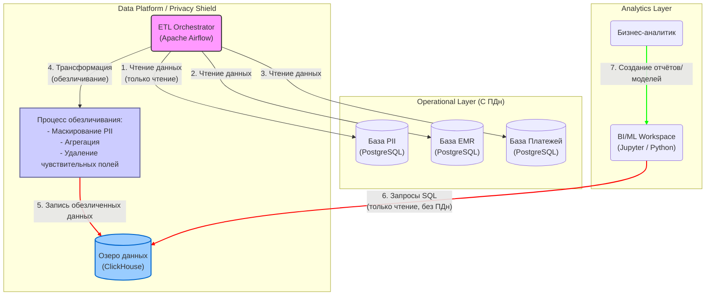

### **Задание 2. Проектирование целевой архитектуры с учётом Privacy by Design**

### **1. Предложение новых блоков в архитектуру (C4)**

#### **C4 Диаграмма контейнеров (Уровень 2) - Целевое состояние (TO-BE)**

```mermaid
C4Container
    title Diagrama de contenedores del sistema objetivo (TO-BE) para "Медикаменте"

    Person(patient, "Пациент", "Пользователь медицинских услуг")
    Person(admin, "Сотрудник ресепшена", "Регистрирует пациентов и записи")
    Person(doctor, "Врач", "Медицинский специалист")
    Person(cashier, "Кассир", "Принимает оплату")
    Person(bookkeeper, "Бухгалтер", "Ведёт финансовый учёт")
    Person(analyst, "Бизнес-аналитик", "Строит отчёты и модели")
    System_Ext(lab, "Внешняя лаборатория", "Предоставляет результаты анализов по API")

    Boundary(ui, "Уровень представления (Frontend)") {
        Container(patient_portal, "Портал пациента", "React / Mobile App", "Личный кабинет для записи и просмотра данных")
        Container(staff_portal, "Портал сотрудника", "React", "Интерфейс для ресепшена, врачей, кассиров")
    }

    Boundary(gateway, "Периметр безопасности") {
        Container(api_gw, "API Gateway", "Kong / Nginx", "Аутентификация, маршрутизация, rate limiting, сбор метаданных для аудита")
    }

    Boundary(app, "Уровень приложений (Kubernetes)") {
        Container(auth_svc, "Сервис аутентификации", "Java / Spring Boot", "Управление идентификацией (SSO), выдача JWT")
        Container(patient_svc, "CRM: Сервис пациентов", "Java / Spring Boot", "Управление профилями пациентов (PII)")
        Container(appointment_svc, "Сервис записи", "Java / Spring Boot", "Управление расписанием и записью на приём")
        Container(payment_svc, "Платёжный шлюз", "Java / Spring Boot", "Обработка платежей, интеграция с ККМ")
        Container(emr_svc, "EMR: Сервис мед. карты", "Java / Spring Boot", "Управление медицинскими данными (анализы, диагнозы)")
        Container(integration_engine, "Интеграционная шина", "Apache Camel / Spring Integration", "Оркестрация интеграций с внешними системами (лаборатория)")
    }

    Boundary(data, "Уровень данных") {
        ContainerDb(pii_db, "База данных PII", "PostgreSQL", "Хранение идентификационных данных (зашифрованные столбцы)")
        ContainerDb(emr_db, "База данных EMR", "PostgreSQL", "Хранение медицинских данных (псевдонимизированных)")
        ContainerDb(payment_db, "База данных платежей", "PostgreSQL", "Хранение финансовых транзакций")
        ContainerDb(audit_db, "Хранилище аудита", "Elasticsearch / PostgreSQL", "Журналы доступа и действий")
        Container(file_storage, "Файловое хранилище", "MinIO (S3)", "Хранение сканов, результатов анализов с тегами")
    }

    Boundary(analytics, "Аналитический слой (Data Platform)") {
        Container(etl, "ETL / Data Orchestration", "Apache Airflow", "Сбор, очистка и обезличивание данных")
        Container(data_lake, "Озеро данных", "ClickHouse / S3", "Хранение обезличенных данных для аналитики")
        Container(ml_workspace, "BI/ML Workspace", "Jupyter / Python", "Среда для построения отчётов и моделей")
    }

    Rel(patient, patient_portal, "Использует", "HTTPS")
    Rel(admin, staff_portal, "Использует", "HTTPS")
    Rel(doctor, staff_portal, "Использует", "HTTPS")
    Rel(cashier, staff_portal, "Использует", "HTTPS")
    Rel(bookkeeper, staff_portal, "Использует", "HTTPS")
    Rel(analyst, ml_workspace, "Использует", "HTTPS")

    Rel(patient_portal, api_gw, "API-запросы", "HTTPS/JWT")
    Rel(staff_portal, api_gw, "API-запросы", "HTTPS/JWT")

    Rel(api_gw, auth_svc, "Проверка токена", "gRPC/HTTP")
    Rel(api_gw, patient_svc, "Запросы к профилям", "gRPC/HTTP")
    Rel(api_gw, appointment_svc, "Запросы к записи", "gRPC/HTTP")
    Rel(api_gw, payment_svc, "Запросы к оплате", "gRPC/HTTP")
    Rel(api_gw, emr_svc, "Запросы к мед. картам", "gRPC/HTTP")

    Rel(integration_engine, lab, "Отправка заказов/Получение результатов", "HTTPS/mTLS")

    Rel(auth_svc, pii_db, "Чтение/Запись", "SQL/TLS")
    Rel(patient_svc, pii_db, "Чтение/Запись", "SQL/TLS")
    Rel(appointment_svc, emr_db, "Чтение/Запись", "SQL/TLS")
    Rel(payment_svc, payment_db, "Чтение/Запись", "SQL/TLS")
    Rel(emr_svc, emr_db, "Чтение/Запись", "SQL/TLS")
    Rel(emr_svc, file_storage, "Чтение/Запись файлов", "S3 API/TLS")

    Rel(integration_engine, file_storage, "Загрузка результатов анализов", "S3 API/TLS")
    Rel(integration_engine, emr_db, "Запись метаданных", "SQL/TLS")

    Rel(patient_svc, audit_db, "Логирование доступа к PII", "HTTP/Beats")
    Rel(emr_svc, audit_db, "Логирование доступа к EMR", "HTTP/Beats")
    Rel(payment_svc, audit_db, "Логирование транзакций", "HTTP/Beats")
    Rel(api_gw, audit_db, "Логирование запросов", "HTTP/Beats")

    Rel(etl, pii_db, "Чтение (обезличенных данных)", "SQL/TLS")
    Rel(etl, emr_db, "Чтение (обезличенных данных)", "SQL/TLS")
    Rel(etl, payment_db, "Чтение (обезличенных данных)", "SQL/TLS")
    Rel(etl, data_lake, "Запись обезличенных данных", "SQL/Native")
    Rel(ml_workspace, data_lake, "Чтение обезличенных данных", "SQL/JDBC")
    Rel(analyst, ml_workspace, "Выполнение запросов", "HTTP")
    
    UpdateLayoutConfig($c4ShapeInRow="3", $c4BoundaryInRow="1")
```

#### **Описание новых и ключевых блоков архитектуры:**

| Блок (Контейнер) | Назначение с точки зрения Privacy by Design | Реализация и принципы |
| :--- | :--- | :--- |
| **API Gateway** | **Единая точка входа и политик.** Выступает как первый фильтр для всех запросов. Собирает метаданные о каждом обращении (кто, когда, к какому ресурсу) для системы аудита. Может применять rate limiting для защиты от брутфорса. | Реализуется на **Kong** или **Nginx**. Конфигурация маршрутов и политик безопасности хранится в декларативных файлах (YAML), управляется через GitOps. Это обеспечивает **конфигурируемость** без изменения кода сервисов. |
| **Сервис аутентификации (Auth Service)** | **Централизованное управление идентификацией (IAM).** Реализует единый вход (SSO) и выпуск JWT-токенов с ролями (RBAC) и атрибутами (ABAC). Токен содержит минимально необходимую информацию (ID пользователя, роли), но не ПДн. | Используется **Keycloak**. Настройка мапперов токенов, провайдеров идентификации, политик паролей делается через конфигурацию Keycloak (экспортируемую в JSON), а не через код. |
| **Отдельные базы данных (PII, EMR, Payments)** | **Сегрегация данных по уровню критичности.** Прямые идентификаторы (PII) хранятся отдельно от медицинских и финансовых данных. Это позволяет применять разные политики шифрования, резервного копирования и доступа к разным категориям. | **PostgreSQL**. Для PII-данных используется **прозрачное шифрование данных (TDE)** на уровне таблиц или столбцов с помощью `pgcrypto`. Связь между базами осуществляется только по ссылочным ID (псевдонимизация). |
| **Файловое хранилище (MinIO)** | **Безопасное хранение неструктурированных данных с тегированием.** Вместо файлового сервера с правами на папки, используется объектное хранилище. Каждый файл при загрузке получает теги (метаданные), которые определяют политику доступа и шифрования. | **MinIO** с включённым шифрованием на стороне сервера (SSE). Политики доступа настраиваются на основе тегов (тегированная модель ABAC). Все настройки (бакеты, политики, пользователи) описываются в конфигурации (YAML) или через `mc` (MinIO Client) в скриптах. |
| **Хранилище аудита (Audit DB)** | **Централизованный, неизменяемый журнал.** Все сервисы и API Gateway отправляют сюда логи о доступе к данным. Это единственный источник истины для расследования инцидентов. | **Elasticsearch** (для полнотекстового поиска) или **PostgreSQL** с настроенным журналом. Важно настроить **иммутабельность** (запрет на удаление/изменение записей) на уровне конфигурации БД. |
| **Интеграционная шина** | **Обеспечение псевдонимизации на границах системы.** При отправке данных во внешние системы (лаборатория) шина гарантирует, что ПДн не покинут периметр. При получении данных, она автоматически раскладывает их по правильным хранилищам и назначает теги. | Реализуется на **Apache Camel** или **Spring Integration**. Маршруты и трансформации данных описываются в конфигурации (Java DSL или XML), что упрощает изменение логики интеграции. |
| **ETL-процессы (Apache Airflow)** | **Реализация Data Minimization для аналитики.** Это шлюз между операционными базами (с ПДн) и аналитическим слоем. Его задача — забирать данные, обезличивать их (удалять или заменять прямые идентификаторы) и только потом складывать в озеро данных. | **Apache Airflow**. DAG'и (пайплайны) описываются на Python и хранятся в Git. В них явно прописаны шаги по маскированию, обфускации или агрегации данных перед записью в ClickHouse. |

---

### **2. Проектирование аналитического слоя (Data Platform) с учётом Privacy by Design**
#### **2.1. Структура аналитического слоя**

Предлагается следующая структура, изолирующая сырые данные от аналитиков:

1.  **Источники данных (Operational Layer):** Базы данных (PII, EMR, Payments) и файловое хранилище (MinIO). Доступ к ним из аналитического слоя напрямую **запрещён**.
2.  **Слой подготовки данных (ETL Layer):** Реализуется в **Apache Airflow**.
    *   **Экстракция:** Чтение данных из источников. На этом этапе важно настроить подключения с минимальными привилегиями (только чтение).
    *   **Трансформация (Обезличивание):** Самый важный шаг.
        *   **Маскирование:** Замена прямых идентификаторов (ФИО, телефон, email) на хэши или фиктивные значения. Например, `Иванов Иван Иванович` -> `Пациент #12345`.
        *   **Обобщение (Generalization):** Замена точных значений на интервалы. Например, возраст 35 лет -> возрастная группа `30-40`.
        *   **Удаление:** Полное удаление столбцов, не нужных для аналитики (точный адрес, паспортные данные).
    *   **Загрузка:** Запись уже обезличенных, чистых данных в озеро данных (Data Lake).
3.  **Озеро данных (Data Lake):** Хранилище для обезличенных и агрегированных данных.
    *   **ClickHouse** идеально подходит для этой роли, так как это колоночная БД, оптимизированная для аналитических запросов и работы с большими объёмами. Данные здесь хранятся в виде "плоских" таблиц, готовых для построения отчётов.
    *   **Важно:** В ClickHouse **не должно быть** ни одного прямого идентификатора. Если необходимо связать данные с пациентом, используется тот самый обезличенный ID, который не позволяет установить личность человека вне контекста операционной системы.
4.  **Слой доступа (BI/ML Workspace):**
    *   **Jupyter Hub** с Python. Аналитики работают в изолированных средах (контейнерах).
    *   Доступ к данным в ClickHouse осуществляется с использованием учетных записей, которые имеют права только на чтение и только к определённым обезличенным таблицам. Политика "что видит аналитик" определяется на уровне БД или с помощью инструментов типа **Apache Ranger**, который позволяет централизованно задавать права доступа к данным в озере.

#### **2.2. Диаграмма потоков данных в аналитическом слое**

#### **2.3. Ключевые принципы, реализованные в этом слое:**

*   **Data Minimization (Минимизация данных):** В аналитику попадает только необходимый минимум данных. Мы не храним там ПДн, потому что для анализа трендов, ABC-анализа или обучения ML-моделей они не нужны.
*   **Privacy by Default (Конфиденциальность по умолчанию):** Обезличивание применяется автоматически на этапе ETL. Аналитик по умолчанию не имеет доступа к реальным данным пациентов.
*   **End-to-end Data Lineage (Сквозное отслеживание происхождения):** Airflow позволяет отследить, откуда пришла каждая порция данных и какие трансформации она прошла. Это критически важно для соответствия требованиям регуляторов и для отладки.
*   **Масштабируемость:** ClickHouse и Airflow прекрасно масштабируются горизонтально, что позволяет обрабатывать пятикратный и больший рост объёмов данных.

