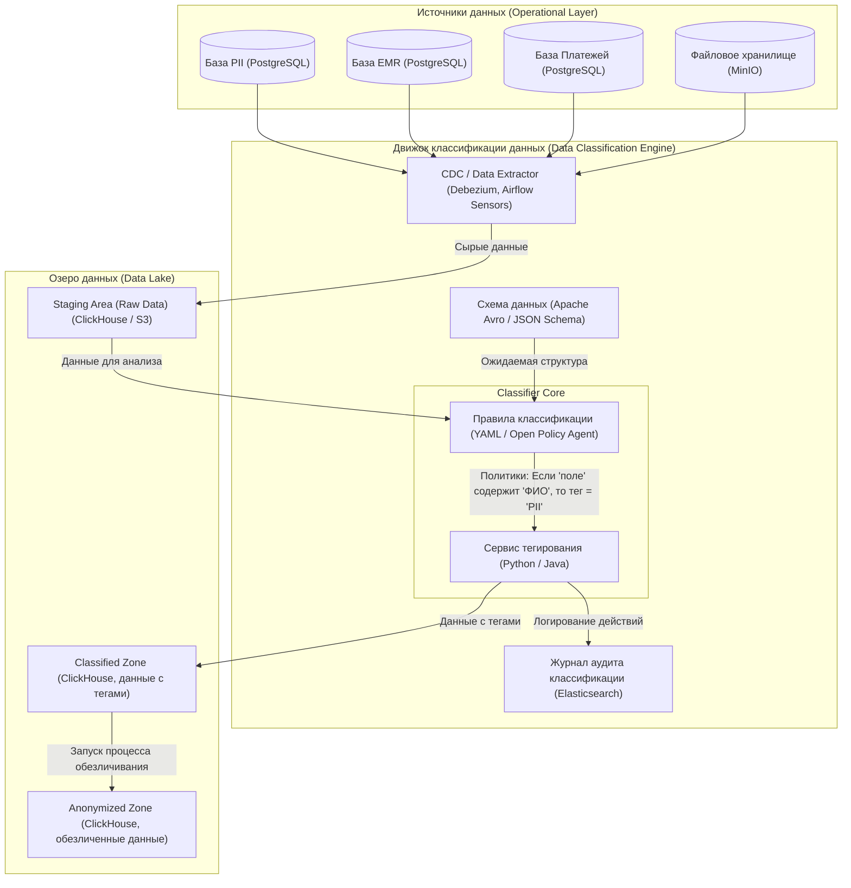

### **Задание 6. Классификация данных**
### **1. Проектирование движка для классификации данных (Data Classification Engine)**
#### **1.1. Архитектура движка классификации**

Предлагается следующая архитектура движка, основанная на принципах "policy as code" и "schema-on-read" с обогащением.

#### **1.2. Описание компонентов движка**

| Компонент | Назначение | Реализация и конфигурация |
| :--- | :--- | :--- |
| **CDC / Data Extractor** | Отвечает за захват изменений (Change Data Capture) из операционных баз или периодическую выгрузку (батчами) из файлового хранилища. | **Debezium** для потокового захвата изменений из PostgreSQL. **Airflow Sensors** для запуска DAG'ов по расписанию или при появлении новых файлов в MinIO. |
| **Schema Registry** | Хранит ожидаемые схемы данных для каждого источника. Позволяет обнаруживать структурные изменения (добавление/удаление колонок). | **Apache Avro Schema Registry** или **JSON Schema Store**. При изменении схемы, Rule Engine получает сигнал для пересмотра правил классификации для новых полей. |
| **Rule Engine (Policy as Code)** | Сердце движка. Содержит правила классификации. Правила определяют, к какому классу чувствительности отнести то или иное поле. | **Open Policy Agent (OPA)** — декларативный язык для написания политик. Правила хранятся в Git и применяются к данным. Пример правила на Rego (язык OPA):   `default pii = false`   `pii { "full_name" in input.column_names }`   `pii { re_match(".*passport.*", input.column_name) }` |
| **Tagging Service** | Применяет теги к данным (как к структурированным данным в БД, так и к метаданным файлов) на основе результатов работы Rule Engine. | Микросервис на Python/Java, который читает данные из Staging Area, применяет к ним политики из OPA и записывает результат (данные + теги) в Classified Zone. |
| **Audit Log** | Логирует, какие правила и к каким данным были применены. Это необходимо для соответствия требованиям (Data Lineage) и для отладки. | **Elasticsearch**. Каждое применение правила фиксируется с меткой времени, версией правила и идентификатором данных. |

#### **1.3. Обработка структурных изменений (Schema Evolution)**

1.  **Обнаружение:** CDC-компонент или Airflow DAG замечает, что структура данных в источнике изменилась (например, добавилась колонка `insurance_policy_number` в таблице пациентов).
2.  **Сигнал:** Событие об изменении схемы отправляется в Rule Engine.
3.  **Реакция (Policy Review):**
    *   **Автоматическая:** Если для нового поля можно применить существующее правило по маске имени (например, `.*policy.*`), движок автоматически назначит ему тег, например, `pii=true`.
    *   **Требующая вмешательства:** Если новое поле не подпадает ни под одно правило, оно помечается как `unclassified` и отправляется алерт администратору данных (Data Steward). Администратор должен либо обновить политику в OPA, либо вручную классифицировать поле.
4.  **Применение:** После обновления политики, все новые данные будут классифицироваться по-новому. Исторические данные в Staging Area могут быть переклассифицированы повторным запуском ETL-процесса.

---

### **2. Организация слоёв в хранилище данных (Data Lake) с учётом конфиденциальности**

Для обеспечения безопасности и соответствия принципу Data Minimization, озеро данных должно быть разделено на изолированные зоны с разными политиками доступа.

| Слой (Зона) | Назначение | Содержимое | Политика доступа |
| :--- | :--- | :--- | :--- |
| **Staging Area (Сырая зона)** | Временное хранилище для данных "как есть" прямо из источника. | Точная копия данных из операционных систем (включая все ПДн). Используется только для первичной загрузки и классификации. | **Максимально ограничен.** Доступ только у движка классификации и узкого круга администраторов данных. Данные хранятся здесь минимально необходимое время (не более 24 часов). |
| **Classified Zone (Зона классифицированных данных)** | Зона, где данные уже размечены тегами, но ПДн всё ещё присутствуют в открытом виде (зашифрованы на уровне столбцов). | Таблицы, аналогичные операционным, но с дополнительным столбцом `_tags` (массив тегов) или с тегами, хранящимися в отдельной системе метаданных. | **Строго по ролям.** Доступ к чтению ПДн имеют только те сервисы, которым это необходимо для работы (например, сервис, который строит отчёты для врачей). Аналитики доступа к этому слою не имеют. |
| **Anonymized Zone (Обезличенная зона)** | Основной слой для аналитики (BI, ML, AI). Содержит данные, прошедшие процесс обезличивания (псевдонимизации, агрегации, обобщения). | Прямые идентификаторы удалены или заменены на хэши. Чувствительные данные обобщены до интервалов. | **Доступ для чтения всем аналитикам и BI-инструментам.** Этот слой не содержит ПДн, поэтому риски утечки минимальны. |

**Процесс перемещения данных между слоями:**
1.  Данные из Staging попадают в Classified Zone через **Tagging Service**, который применяет теги.
2.  Специализированный ETL-процесс (также в Airflow) читает данные из Classified Zone и, используя политики обезличивания (например, "заменить поле `full_name` на хэш", "обобщить поле `age` до возрастной группы"), записывает результат в Anonymized Zone.

---

### **3. Метрики для оценки эффективности классификации**

Для того чтобы понимать, насколько хорошо работает движок, и где его нужно улучшать, мы должны собирать следующие метрики:

| Метрика | Описание | Цель | Инструмент |
| :--- | :--- | :--- | :--- |
| **Точность классификации (Classification Accuracy)** | Процент полей/объектов, которым был присвоен корректный тег (проверяется путем выборочного ручного аудита). | Обеспечить, что конфиденциальные данные не попадают в обезличенную зону без маскировки. Цель: >99.9%. | Аудит логов + выборочная проверка данных в Classified и Anonymized зонах. |
| **Полнота классификации (Coverage)** | Процент данных, которые получили хотя бы один тег. Данные без тегов не могут быть перемещены в Anonymized Zone. | Минимизировать количество "серых" зон, где статус данных неизвестен. Цель: 100% для всех данных, используемых в аналитике. | Запрос к данным Classified Zone: `SELECT count(*) FROM table WHERE _tags IS NULL`. |
| **Время реакции на изменение схемы (Schema Change Detection Time)** | Время от момента изменения схемы в источнике до момента обновления правил классификации. | Минимизировать окно, в котором новые, потенциально чувствительные данные, могут быть неверно классифицированы. Цель: < 1 часа (в идеале — автоматически). | Метрики времени в Apache Airflow (время от запуска DAG до его завершения) + алерты от Schema Registry. |
| **Количество ложных срабатываний (False Positives)** | Количество случаев, когда данные были ошибочно помечены как чувствительные и обезличены, хотя могли оставаться в открытом виде. | Снизить избыточную обработку и потерю полезной информации для аналитики. | Анализ жалоб аналитиков на "пропавшие" данные + сверка с бизнес-контекстом. |

Эти метрики должны быть собраны в систему мониторинга (например, **VictoriaMetrics** или **Prometheus**) и отображаться на дашборде для команды Data Governance. Отклонение метрик от цели генерирует алерт.

---

### **4. Обеспечение масштабируемости (Scalability)**

Спроектированная система должна легко масштабироваться при пятикратном и более росте объёмов данных и количества пользователей.

1.  **Горизонтальное масштабирование компонентов:**
    *   **Airflow:** Может быть развернут с несколькими исполнителями (workers) и очередями задач (Celery), что позволяет параллельно обрабатывать множество потоков данных.
    *   **ClickHouse:** Изначально спроектирован для горизонтального масштабирования (шардинг и репликация). При росте объёма данных мы просто добавляем новые узлы в кластер.
    *   **OPA:** Может быть развернут как отдельный сервис и кэшировать результаты принятия решений, чтобы не нагружать Rule Engine при обработке миллионов однотипных записей.

2.  **Автоматизация добавления новых источников данных:**
    *   Благодаря **Schema Registry** и **OPA**, добавление нового источника данных (например, новой CRM-системы) сводится к регистрации его схемы и, возможно, добавлению нескольких строк в политики OPA. Это не требует переписывания кода движка.

3.  **Управление вычислительными ресурсами:**
    *   Все компоненты движка (Airflow workers, сервисы классификации) должны быть развернуты в **Kubernetes** с использованием **Horizontal Pod Autoscaler (HPA)**. HPA будет автоматически увеличивать количество подов в часы пиковых нагрузок (например, ночью, когда запускаются ETL-процессы) и уменьшать в периоды простоя, оптимизируя затраты.
